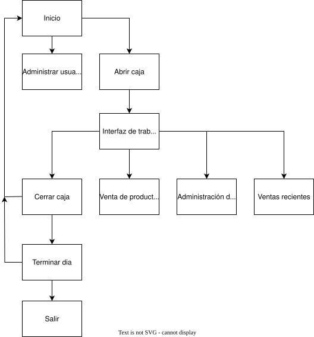

# 🛒 EzWork – Sistema de Punto de Venta

Aplicación de escritorio, diseñada para facilitar la gestión diaria de un negocio físico.
Permite controlar ventas, productos, empleados, turnos, caja y clientes, funcionando de manera **100% offline** mediante una base de datos local SQLite.
Fue desarrollada para uso personal y actualmente se encuentra funcionando en un entorno real de trabajo.

---

## 🚀 Características principales

- **Registro de ventas** con detalle de productos, precios, cantidades y método de pago  
- **Control de turnos** (entrada, salida, horas trabajadas y minutos acumulados)  
- **Gestión de empleados**, incluyendo pago parcial o completo de jornadas  
- **Control de stock** con actualización automática por cada venta  
- **Cierre de caja** con estadísticas de ventas e ingresos por método de pago  
- **Resumen diario** con información consolidada del día completo  
- **Sistema de fiado para clientes**, con historial de pagos y deuda total  
- **Interfaz intuitiva**, con páginas bien definidas y diálogos dedicados  
- **Widgets personalizados reutilizables** para mantener la UI modular  
- **Actualización automática** mediante Updater + Migrator (migraciones SQL seguras)

---

## 🧰 Tecnologías utilizadas

- **C++ (moderno)**
- **Qt 6 / QtWidgets**
- **Qt Creator**
- **SQLite**
- **Arquitectura modular (DAOs, Services, Managers)**
- **Signals & Slots para comunicación desacoplada**

---

## 🏗️ Arquitectura y diseño del sistema

El proyecto está organizado en capas claramente separadas:

### 🔹 1. Presentación (UI)
- Páginas (`PageLogin`, `PageWorkInterface`, `PageProducts`, etc.)
- Widgets personalizados para reutilizar lógica visual
- Diálogos específicos para acciones como pagos, mensajes o confirmaciones

### 🔹 2. Lógica de negocio
- **Managers** encargados de manejar datos en memoria y estado de la aplicación  
  (productos, empleados, clientes, turnos, caja)

### 🔹 3. Acceso a Datos
- Clases DAO dedicadas para interactuar con SQLite  
- Aislamiento completo del acceso a la base de datos
- Operaciones atómicas usando transacciones y commits

### 🔹 4. Servicios
- Orquestan operaciones complejas que involucran múltiples DAOs
- Simplifican la interacción entre la lógica de UI y la base de datos

---

## 🗄️ Base de datos

La base de datos utiliza múltiples tablas relacionadas mediante claves foráneas, entre ellas:

- `sales`, `sale_products`  
- `products`  
- `users`, `shifts`, `payments`  
- `cash_registers`, `cash_register_details`  
- `daily_info`, `daily_info_details`  
- `customers`, `credit_sales`, `customer_payments`  
- `operations`, `operation_details`  
- `audit_log`

Cada venta registra un **snapshot completo del producto** en el momento de la transacción  
(nombre, precio, cantidad), garantizando integridad histórica.

Las actualizaciones de la base de datos no son ejecutadas por el POS directamente, sino mediante un Migrator externo que es lanzado por el EzWorkUpdater. Estos componentes forman parte del ecosistema general del sistema, pero operan como aplicaciones independientes.

---

## 🔄 Sistema de actualización

Como mencioné anteriormente, la actualización depende de otros 2 componentes totalmente independientes de la app:

### **EzWorkUpdater**
- Verifica versiones disponibles en el servidor  
- Descarga la versión correspondiente  
- Ejecuta Migrator en caso de necesitar cambios en la base de datos  
- Lanza el POS automáticamente al finalizar la actualización

### **Migrator**
- Ejecuta scripts `.sql` dentro de una transacción
- Los errores generados durante la migración son capturados por el EzWorkUpdater, que los persiste en un archivo de log.

Nota: Para migraciones que requieren lógica adicional (transformación de datos, reorganización de tablas, normalización, etc.), el ejecutable base del migrator puede ser reemplazado por una versión especializada para esa actualización.

---

## 🧪 Flujo de uso

1. El empleado inicia sesión  
2. Define el monto inicial de caja  
3. Comienza su turno (registro de entrada)  
4. Realiza ventas, ingresos o egresos  
5. El sistema descuenta stock automáticamente  
6. Al finalizar, cierra caja y registra salida  
7. El administrador puede ver estadísticas y pagar empleados  
8. El día finaliza con un resumen global consolidado

---

## 📌 Futuras mejoras

- Página de informe mensual
- Sistema más avanzado de reportes y gráficos
- Escaner de pdf que actualizaría precios y stock automáticamente
- Más atajos de teclado para facilitar navegación
- Sistema avanzado de visualización de productos de bajo stock, priorizando los productos que son vendidos con mas frecuencia
- Mejoras visuales en la interfaz
- Implementación de tests unitarios  

### Versión cloud con autenticación y soporte para múltiples negocios
Implementación de un sistema de cuentas donde el usuario inicia sesión antes de acceder al POS.  
Esto permitirá que, si el usuario instala el POS en otra computadora (por ejemplo, para un segundo negocio), pueda vincularla a su cuenta y gestionar varios locales de manera independiente.

Además, un panel web permitirá acceder desde el celular a métricas, reportes e información consolidada o separada por negocio, ofreciendo una administración centralizada de todos los puntos de venta asociados a la cuenta del usuario.

---

## 📄 Licencia

Este proyecto es de uso personal. No está destinado a distribución pública sin autorización.
